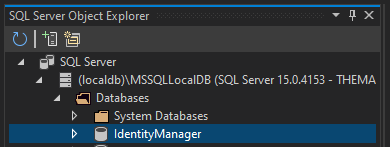

# Table of Contents

- [Table of Contents](#table-of-contents)
  - [Introduction](#introduction)
  - [Prerequisites](#prerequisites)
    - [.NET 6.0](#net-60)
    - [Visual Studio 2022](#visual-studio-2022)
    - [Mobile Development with .NET Workload](#mobile-development-with-net-workload)
  - [Demo](#demo)
    - [Create a `netstandard` Class Library](#create-a-netstandard-class-library)
    - [Create a Blazor Server Application](#create-a-blazor-server-application)
  - [Summary](#summary)
  - [Complete Code](#complete-code)
  - [Resources](#resources)

## Introduction

In this demo, we are going to build a `netstandard` class library based on the `GitHub` repo by `mguinness` that was shown in episodes [Basic Authentication and Authorization in Blazor Server: Carl Franklin's Blazor Train ep 26
](https://www.youtube.com/watch?v=mbNFscKBsy8&list=PL8h4jt35t1wjvwFnvcB2LlYL4jLRzRmoz&index=30&t=790s), and [Basic Authentication and Authorization in Blazor Web Assembly: Carl Franklin's Blazor Train ep 27](https://www.youtube.com/watch?v=I3A1R-oBK7c&list=PL8h4jt35t1wjvwFnvcB2LlYL4jLRzRmoz&index=31), and that you can find [here](https://github.com/mguinness/IdentityManagerUI).

Then, we are going to build a Blazor Server application, and make use of the `netstandard` class library.

The end results will look like this:


## Prerequisites

The following prerequisites are needed for this demo.

### .NET 6.0

Download the latest version of the .NET 6.0 SDK [here](https://dotnet.microsoft.com/en-us/download).

### Visual Studio 2022

For this demo, we are going to use the latest version of [Visual Studio 2022](https://visualstudio.microsoft.com/vs/community/).

### Mobile Development with .NET Workload

In order to build Blazor apps, the ASP.NET and web development workload needs to be installed, so if you do not have that installed let's do that now.

  

## Demo

In the following demo we will first create a `netstandard` class library, based on the `GitHub` repo [mguinness/IdentityManagerUI](https://github.com/mguinness/IdentityManagerUI), then we are going to build a Blazor Server application, to make use of the `netstandard` class library.

### Create a `netstandard` Class Library

Open Visual Studio 2022, and create a `Class Library` project.

  

  

  

Add the following classes:

1. **ApplicationRole.cs**
1. **ApplicationUser.cs**
1. **Extensions.cs**
1. **Manager.cs**
1. **Response.cs**
1. **Role.cs**
1. **User.cs**

Add the following code to each class:

File **ApplicationRole.cs**:

```csharp
using Microsoft.AspNetCore.Identity;
using System.Collections.Generic;

namespace IdentityManager
{
    public class ApplicationRole : IdentityRole
    {
        public ApplicationRole() { }

        public ApplicationRole(string roleName) : base(roleName) { }

        public virtual ICollection<IdentityRoleClaim<string>>? Claims { get; set; }
    }
}
```

File **ApplicationUser.cs**:

```csharp
using Microsoft.AspNetCore.Identity;
using System.Collections.Generic;

namespace IdentityManager
{
    public class ApplicationUser : IdentityUser
    {
        public virtual ICollection<IdentityUserRole<string>>? Roles { get; set; }
        public virtual ICollection<IdentityUserClaim<string>>? Claims { get; set; }
    }
}
```

File **Extensions.cs**:

```csharp
using Microsoft.AspNetCore.Identity;
using System.Collections.Generic;

namespace IdentityManager
{
    public static class Extensions
    {
        public static string GetAllMessages(this IEnumerable<IdentityError> errors)
        {
            var result = string.Empty;

            foreach (var error in errors)
            {
                result += string.IsNullOrEmpty(result) ? string.Empty : " ";
                result += error.Description;
            }

            return result;
        }
    }
}
```

File **Manager.cs**:

```csharp
using System.Linq;
using Microsoft.AspNetCore.Identity;
using Microsoft.EntityFrameworkCore;
using System.Collections.Generic;
using System.Security.Claims;
using System.Reflection;
using System;
using System.Threading.Tasks;

namespace IdentityManager
{
    public class Manager
    {
        private readonly UserManager<ApplicationUser> _userManager;
        private readonly RoleManager<ApplicationRole> _roleManager;
        private readonly Dictionary<string, string> _roles;
        private readonly Dictionary<string, string> _claimTypes;

        public Manager(UserManager<ApplicationUser> userManager, RoleManager<ApplicationRole> roleManager)
        {
            _userManager = userManager;
            _roleManager = roleManager;
            _roles = roleManager.Roles.ToDictionary(r => r.Id, r => r.Name);
            var fldInfo = typeof(ClaimTypes).GetFields(BindingFlags.Static | BindingFlags.Public);
            _claimTypes = fldInfo.ToDictionary(i => i.Name, i => (string)i.GetValue(null));
        }

        public IEnumerable<User> GetUsers(string? filter = null) // , string direction = "asc"
        {
            filter = filter?.Trim();

            var users = _userManager.Users.Include(u => u.Roles).Include(u => u.Claims);

            var query = users.Where(u =>
                (string.IsNullOrWhiteSpace(filter) || u.Email.Contains(filter)) ||
                (string.IsNullOrWhiteSpace(filter) || u.UserName.Contains(filter))
            ).OrderBy(u => u.UserName);

            var result = query.ToArray().Select(u => new User
            {
                Id = u.Id,
                Email = u.Email,
                LockedOut = u.LockoutEnd == null ? string.Empty : "Yes",
                Roles = u.Roles.Select(r => _roles[r.RoleId]),
                //Key/Value props not camel cased (https://github.com/dotnet/corefx/issues/41309)
                Claims = u.Claims.Select(c => new KeyValuePair<string, string>(_claimTypes.Single(x => x.Value == c.ClaimType).Key, c.ClaimValue)),
                DisplayName = u.Claims?.FirstOrDefault(c => c.ClaimType == ClaimTypes.Name)?.ClaimValue,
                UserName = u.UserName
            });

            return result;
        }

        public async Task<Response> CreateUser(string userName, string name, string email, string password)
        {
            if (string.IsNullOrWhiteSpace(userName))
                throw new ArgumentNullException("userName", "The argument userName cannot be null or empty.");

            if (string.IsNullOrWhiteSpace(name))
                throw new ArgumentNullException("name", "The argument name cannot be null or empty.");

            if (string.IsNullOrWhiteSpace(email))
                throw new ArgumentNullException("email", "The argument email cannot be null or empty.");

            if (string.IsNullOrWhiteSpace(password))
                throw new ArgumentNullException("password", "The argument password cannot be null or empty.");

            var response = new Response();
            var user = new ApplicationUser() { Email = email, UserName = userName };
            var result = await _userManager.CreateAsync(user, password);

            if (result.Succeeded)
            {
                if (name != null)
                    await _userManager.AddClaimAsync(user, new Claim(ClaimTypes.Name, name));
            }
            else
            {
                response.Messages = result.Errors.GetAllMessages();
            }

            response.Success = result.Succeeded;

            return response;
        }

        public async Task<Response> UpdateUser(string id, string email, bool locked, string[] roles, List<KeyValuePair<string, string>> claims)
        {
            if (string.IsNullOrWhiteSpace(id))
                throw new ArgumentNullException("id", "The argument id cannot be null or empty.");

            if (string.IsNullOrWhiteSpace(email))
                throw new ArgumentNullException("email", "The argument email cannot be null or empty.");

            var response = new Response();

            try
            {
                var user = await _userManager.FindByIdAsync(id);
                if (user == null)
                    response.Messages = "User not found.";

                user!.Email = email;
                user.LockoutEnd = locked ? DateTimeOffset.MaxValue : default(DateTimeOffset?);

                var result = await _userManager.UpdateAsync(user);

                if (result.Succeeded)
                {
                    response.Messages += $"Updated user {user.UserName}";

                    var userRoles = await _userManager.GetRolesAsync(user);

                    foreach (string role in roles.Except(userRoles))
                        await _userManager.AddToRoleAsync(user, role);

                    foreach (string role in userRoles.Except(roles))
                        await _userManager.RemoveFromRoleAsync(user, role);

                    var userClaims = await _userManager.GetClaimsAsync(user);

                    foreach (var kvp in claims.Where(a => !userClaims.Any(b => _claimTypes[a.Key] == b.Type && a.Value == b.Value)))
                        await _userManager.AddClaimAsync(user, new Claim(_claimTypes[kvp.Key], kvp.Value));

                    foreach (var claim in userClaims.Where(a => !claims.Any(b => a.Type == _claimTypes[b.Key] && a.Value == b.Value)))
                        await _userManager.RemoveClaimAsync(user, claim);
                }
                else
                    response.Messages = result.Errors.GetAllMessages();

                response.Success = result.Succeeded;
            }
            catch (Exception ex)
            {
                response.Messages = $"Failure updating user {id}: {ex.Message}";
            }

            return response;
        }

        public async Task<Response> DeleteUser(string id)
        {
            if (string.IsNullOrWhiteSpace(id))
                throw new ArgumentNullException("id", "The argument id cannot be null or empty.");

            var response = new Response();

            try
            {
                var user = await _userManager.FindByIdAsync(id);

                if (user == null)
                    response.Messages = "User not found.";

                var result = await _userManager.DeleteAsync(user!);

                if (result.Succeeded)
                    response.Messages = $"Deleted user {user!.UserName}.";
                else
                    response.Messages = result.Errors.GetAllMessages();

                response.Success = result.Succeeded;
            }
            catch (Exception ex)
            {
                response.Messages = $"Failure deleting user {id}: {ex.Message}";
            }

            return response;
        }

        public async Task<Response> ResetPassword(string id, string password, string verify)
        {
            if (string.IsNullOrWhiteSpace(id))
                throw new ArgumentNullException("id", "The argument id cannot be null or empty.");

            if (string.IsNullOrWhiteSpace(password))
                throw new ArgumentNullException("password", "The argument password cannot be null or empty.");

            if (string.IsNullOrWhiteSpace(verify))
                throw new ArgumentNullException("verify", "The argument verify cannot be null or empty.");

            var response = new Response();

            try
            {
                if (password != verify)
                    response.Messages = "Passwords entered do not match.";

                var user = await _userManager.FindByIdAsync(id);

                if (user == null)
                    response.Messages = "User not found.";

                if (await _userManager.HasPasswordAsync(user!))
                    await _userManager.RemovePasswordAsync(user!);

                var result = await _userManager.AddPasswordAsync(user!, password);

                if (result.Succeeded)
                {
                    response.Messages = $"Password reset for {user!.UserName}.";
                }
                else
                    response.Messages = result.Errors.GetAllMessages();
            }
            catch (Exception ex)
            {
                response.Messages = $"Failed password reset for user {id}: {ex.Message}";
            }

            return response;
        }

        public IEnumerable<Role> GetRoles(string? filter = null)
        {
            var roles = _roleManager.Roles.Include(r => r.Claims);

            var query = roles.Where(r =>
                (string.IsNullOrWhiteSpace(filter) || r.Name.Contains(filter))
            ).OrderBy(r => r.Name); ;

            var result = query.ToArray().Select(r => new Role
            {
                Id = r.Id,
                Name = r.Name,
                //Key/Value props not camel cased (https://github.com/dotnet/corefx/issues/41309)
                Claims = r.Claims.Select(c => new KeyValuePair<string, string>(_claimTypes.Single(x => x.Value == c.ClaimType).Key, c.ClaimValue))
            });

            return result;
        }

        public async Task<Response> CreateRole(string name)
        {
            if (string.IsNullOrWhiteSpace(name))
                throw new ArgumentNullException("name", "The argument name cannot be null or empty.");

            var response = new Response();
            var role = new ApplicationRole(name);
            var result = await _roleManager.CreateAsync(role);

            if (!result.Succeeded)
            {
                response.Messages = result.Errors.GetAllMessages();
            }

            response.Success = result.Succeeded;

            return response;
        }
       
        public async Task<Response> UpdateRole(string id, string name, List<KeyValuePair<string, string>> claims)
        {
            if (string.IsNullOrWhiteSpace(id))
                throw new ArgumentNullException("id", "The argument id cannot be null or empty.");

            if (string.IsNullOrWhiteSpace(name))
                throw new ArgumentNullException("name", "The argument name cannot be null or empty.");

            var response = new Response();

            try
            {
                var role = await _roleManager.FindByIdAsync(id);
                if (role == null)
                    response.Messages = "Role not found.";

                role!.Name = name;

                var result = await _roleManager.UpdateAsync(role);

                if (result.Succeeded)
                {
                    response.Messages += $"Updated role {role.Name}";

                    var roleClaims = await _roleManager.GetClaimsAsync(role);

                    foreach (var kvp in claims.Where(a => !roleClaims.Any(b => _claimTypes[a.Key] == b.Type && a.Value == b.Value)))
                        await _roleManager.AddClaimAsync(role, new Claim(_claimTypes[kvp.Key], kvp.Value));

                    foreach (var claim in roleClaims.Where(a => !claims.Any(b => a.Type == _claimTypes[b.Key] && a.Value == b.Value)))
                        await _roleManager.RemoveClaimAsync(role, claim);
                }
                else
                    response.Messages = result.Errors.GetAllMessages();

                response.Success = result.Succeeded;
            }
            catch (Exception ex)
            {
                response.Messages = $"Failure updating role {id}: {ex.Message}";
            }

            return response;
        }

        public async Task<Response> DeleteRole(string id)
        {
            if (string.IsNullOrWhiteSpace(id))
                throw new ArgumentNullException("id", "The argument id cannot be null or empty.");

            var response = new Response();

            try
            {
                var role = await _roleManager.FindByIdAsync(id);
                if (role == null)
                    response.Messages = "Role not found.";

                var result = await _roleManager.DeleteAsync(role!);

                if (result.Succeeded)
                    response.Messages = $"Deleted role {role!.Name}.";
                else
                    response.Messages = result.Errors.GetAllMessages();

                response.Success = result.Succeeded;
            }
            catch (Exception ex)
            {
                response.Messages = $"Failure deleting role {id}: {ex.Message}";
            }

            return response;
        }
    }
}
```

File **Response.cs**:

```csharp
namespace IdentityManager
{
    public class Response
    {
        public bool Success { get; internal set; } = false;
        public string Messages { get; internal set; } = string.Empty;
    }
}
```

File **Role.cs**:

```csharp
using System.Collections.Generic;

namespace IdentityManager
{
    public class Role
    {
        public string? Id { get; set; }
        public string? Name { get; set; }
        public IEnumerable<KeyValuePair<string, string>>? Claims { get; set; }
    }
}
```

File **User.cs**:

```csharp
using System.Collections.Generic;

namespace IdentityManager
{
    public class User
    {
        public string? Id { get; set; }
        public string? Email { get; set; }
        public string? LockedOut { get; set; }
        public IEnumerable<string>? Roles { get; set; }
        public IEnumerable<KeyValuePair<string, string>>? Claims { get; set; }
        public string? DisplayName { get; set; }
        public string? UserName { get; set; }
    }
}
```

>:blue_book: Notice that **Manager.cs** is the most important file, which contains all the `CRUD` operations performed against the `Microsoft Identity` tables.

### Create a Blazor Server Application

Now, let's create a Blazor Server Application called **IdentityManagerBlazorServer.csproj** that makes use of the `netstandard` class library we just built, to add, list, and delete users and roles.

  

  

  

Delete the following files as we are not going to need them:

1. **WeatherForecast.cs**
2. **WeatherForecastService.cs**
3. **Counter.razor**
4. **FetchData.razor**
5. **SurveyPrompt.razor**

  

Delete the following line from the **Program.cs** file:

```csharp
builder.Services.AddSingleton<WeatherForecastService>();
```

Modify the **appsettings.json** file with this code:

```xml
{
  "ConnectionStrings": {
    "DefaultConnection": "Server=(localdb)\\mssqllocaldb;Database=IdentityManager;Trusted_Connection=True;MultipleActiveResultSets=true"
  },
  "Logging": {
    "LogLevel": {
      "Default": "Information",
      "Microsoft.AspNetCore": "Warning"
    }
  },
  "AllowedHosts": "*"
}
```

Modify the **Program.cs** file with the following code:

```csharp
using IdentityManager;
using IdentityManagerBlazorServer.Areas.Identity;
using IdentityManagerBlazorServer.Data;
using Microsoft.AspNetCore.Components.Authorization;
using Microsoft.AspNetCore.Identity;
using Microsoft.EntityFrameworkCore;

var builder = WebApplication.CreateBuilder(args);

var connectionString = builder.Configuration.GetConnectionString("DefaultConnection");
builder.Services.AddDbContext<ApplicationDbContext>(options =>
    options.UseSqlServer(connectionString));
builder.Services.AddDatabaseDeveloperPageExceptionFilter();

builder.Services.AddDefaultIdentity<ApplicationUser>(options => options.SignIn.RequireConfirmedAccount = true)
    .AddRoles<ApplicationRole>()
    .AddEntityFrameworkStores<ApplicationDbContext>();

builder.Services.AddRazorPages();
builder.Services.AddServerSideBlazor();
builder.Services.AddScoped<AuthenticationStateProvider, RevalidatingIdentityAuthenticationStateProvider<IdentityUser>>();
builder.Services.AddScoped<Manager>();

var app = builder.Build();

// Configure the HTTP request pipeline.
if (app.Environment.IsDevelopment())
{
    app.UseMigrationsEndPoint();
}
else
{
    app.UseExceptionHandler("/Error");
    // The default HSTS value is 30 days. You may want to change this for production scenarios, see https://aka.ms/aspnetcore-hsts.
    app.UseHsts();
}

app.UseHttpsRedirection();

app.UseStaticFiles();

app.UseRouting();

app.UseAuthentication();
app.UseAuthorization();

app.MapControllers();
app.MapBlazorHub();
app.MapFallbackToPage("/_Host");

app.Run();
```

>:blue_book: Notice the code `builder.Services.AddScoped<Manager>();` which will allow our pages to inject an instance of the `Manager` provided by the `IdentityManager` class library, to be able to call it's CRUD operations available.

Open the `Package Manager Console`:

  

And run the following command:

`update-database` to create the `IdentityManager` database, which you can see by opening the `SQL Server Object Explorer`

  

  

Now, let's add a project reference to the `IdentityManager` class library, by adding the following code to the `IdentityManagerBlazorServer.csproj` file:

```xml
  <ItemGroup>
    <ProjectReference Include="..\IdentityManager\IdentityManager\IdentityManager.csproj" />
  </ItemGroup>
```

Now let's add the **Users.razor** and **Roles.razor** pages under the **Pages** folder, with the following code:

Users.razor file:

```razor
@page "/users"
@using IdentityManager
@using Microsoft.AspNetCore.Identity
@inject IdentityManager.Manager manager;

<PageTitle>Users</PageTitle>

<h1>Users</h1>

@if (users == null)
{
    <p><em>Loading...</em></p>
}
else
{
    <NavLink class="btn btn-primary" href="createuser">
        New
    </NavLink>
    <br />
    <br />

    <div class="row">
        <div class="col3">
            Filter:
        </div>
        <div class="col9">
             <input @bind-value:event="oninput" @bind-value="Filter" @onkeyup="GetUsers" />
        </div>
    </div>

    <table class="table">
        <thead>
            <tr>
                <th>Id</th>
                <th>Email</th>
                <th>User Name</th>
                <th>Display Name</th>
                <th>Roles</th>
                <th>Locked Out</th>
            </tr>
        </thead>
        <tbody>
            @foreach (var user in users)
            {
                <tr>
                    <td>@user.Id</td>
                    <td>@user.Email</td>
                    <td>@user.UserName</td>
                    <td>@user.DisplayName</td>
                    <td>
                        @foreach (var role in user.Roles!)
                        {
                            <text>role</text>
                        }
                    </td>
                    <td>@user.LockedOut</td>
                    <td><button type="button" class="btn btn-secondary" @onclick="() => DeleteUser(user.Id!)">Delete</button></td>
                </tr>
            }
        </tbody>
    </table>
}

@code {
    private IEnumerable<User>? users;
    private string Filter { get; set; } = string.Empty;

    protected override void OnInitialized()
    {
        GetUsers();
    }

    private void FilterList()
    {
        GetUsers();
    }

    private async void DeleteUser(string userId)
    {
        var response = await manager.DeleteUser(userId);
        if (response.Success)
        {
            GetUsers();
        }
    }

    private void GetUsers()
    {
        users = manager.GetUsers(Filter);
        StateHasChanged(); 
    }
}
```

Razor.razor file:

```razor
@page "/roles"
@using IdentityManager
@using Microsoft.AspNetCore.Identity
@inject IdentityManager.Manager manager;

<PageTitle>Roles</PageTitle>

<h1>Roles</h1>


@if (roles == null)
{
    <p><em>Loading...</em></p>
}
else
{
    <NavLink class="btn btn-primary" href="createrole">
        New
    </NavLink>
    <br />
    <br />

    <div class="row">
        <div class="col3">
            Filter:
        </div>
        <div class="col9">
            <input @bind-value:event="oninput" @bind-value="Filter" @onkeyup="GetRoles" />
        </div>
    </div>

    <table class="table">
        <thead>
            <tr>
                <th>Id</th>
                <th>Name</th>
            </tr>
        </thead>
        <tbody>
            @foreach (var role in roles)
            {
                <tr>
                    <td>@role.Id</td>
                    <td>@role.Name</td>
                    <td><button type="button" class="btn btn-secondary" @onclick="() => DeleteRole(role.Id!)">Delete</button></td>
                </tr>
            }
        </tbody>
    </table>
}

@code {
    private IEnumerable<Role>? roles;
    private string Filter { get; set; } = string.Empty;

    protected override void OnInitialized()
    {
        GetRoles();
        base.OnInitialized();
    }

    private async void DeleteRole(string roleId)
    {
        var response = await manager.DeleteRole(roleId);
        if (response.Success) GetRoles();
    }

    private void GetRoles()
    {
        roles = manager.GetRoles(Filter);
        StateHasChanged();
    }
}
```

Add a **Components** folder, and add the following two files:

1. AddUser.razor

```razor
@page "/createuser"
@using IdentityManager
@using IdentityManagerBlazorServer.ViewModels
@using Microsoft.AspNetCore.Identity
@using Microsoft.Extensions.Logging
@inject IdentityManager.Manager manager;

<EditForm Model="@user" OnValidSubmit="@CreateUser">
    <div class="row">
        <div class="col3">
            Username:
        </div>
        <div class="col9">
            <InputText id="userName" @bind-Value="user.UserName" />
        </div>
        <div class="col3">
            Name:
        </div>
        <div class="col9">
            <InputText id="name" @bind-Value="user.Name" />
        </div>
        <div class="col3">
            Email:
        </div>
        <div class="col9">
            <InputText id="email" @bind-Value="user.Email" />
        </div>
        <div class="col3">
            Password:
        </div>
        <div class="col9">
            <InputText id="password" type="password" @bind-Value="user.Password" />
        </div>
    </div>
    <br />

    <button type="submit">Submit</button>
    <br />
    <br />

    <DataAnnotationsValidator />
    <ValidationSummary />
</EditForm>

@if (createUser)
{
    @if (response?.Success == true)
    {
        <div style="color:green;">User created successfully.</div>
    }
    else
    {
        <div style="color:red;">An error has occurred when creating user: @response?.Messages</div>
    }
}

@code {
    private ViewModels.UserViewModel user = new();
    private IEnumerable<ViewModels.RoleViewModel>? roles;
    private Response? response = null;
    private bool createUser = false;

    private async void CreateUser()
    {
        createUser = true;
        response = await manager!.CreateUser(user.UserName!, user.Name!, user.Email!, user.Password!);
        StateHasChanged();
    }
}
```

2. AddRole.razor

```razor
@page "/createrole"
@using IdentityManager
@using IdentityManagerBlazorServer.ViewModels
@using Microsoft.AspNetCore.Identity
@using Microsoft.Extensions.Logging
@inject IdentityManager.Manager manager;

<EditForm Model="@role" OnValidSubmit="@CreateRole">
    <div class="row">
        <div class="col3">
            Role name:
        </div>
        <div class="col9">
            <InputText id="name" @bind-Value="role.Name" />
        </div>
    </div>
    <br />

    <button type="submit">Submit</button>
    <br />
    <br />
</EditForm>


@if (createRole)
{
    @if (response?.Success == true)
    {
        <div style="color:green;">Role created successfully.</div>
    }
    else
    {
        <div style="color:red;">An error has occurred when creating role: @response?.Messages</div>
    }
}

@code {
    private ViewModels.RoleViewModel role = new();
    private IEnumerable<IdentityManager.Role>? roles;
    private Response? response = null;
    private bool createRole = false;

    private async void CreateRole()
    {
        createRole = true;
        response = await manager!.CreateRole(role.Name!);
        StateHasChanged();
    }
}
```

Finally, modify the **Shared/NavMenu.razor** with the following code:

```razor
<div class="top-row ps-3 navbar navbar-dark">
    <div class="container-fluid">
        <a class="navbar-brand" href="">Identity Manager Blazor Server</a>
        <button title="Navigation menu" class="navbar-toggler" @onclick="ToggleNavMenu">
            <span class="navbar-toggler-icon"></span>
        </button>
    </div>
</div>

<div class="@NavMenuCssClass" @onclick="ToggleNavMenu">
    <nav class="flex-column">
        <div class="nav-item px-3">
            <NavLink class="nav-link" href="" Match="NavLinkMatch.All">
                <span class="oi oi-home" aria-hidden="true"></span> Home
            </NavLink>
        </div>
        <div class="nav-item px-3">
            <NavLink class="nav-link" href="users">
                <span class="oi oi-people" aria-hidden="true"></span> Users
            </NavLink>
        </div>
        <div class="nav-item px-3">
            <NavLink class="nav-link" href="createuser">
                <span class="oi oi-plus" aria-hidden="true"></span> Add User
            </NavLink>
        </div>
        <div class="nav-item px-3">
            <NavLink class="nav-link" href="roles">
                <span class="oi oi-list" aria-hidden="true"></span> Roles
            </NavLink>
        </div>
        <div class="nav-item px-3">
            <NavLink class="nav-link" href="createrole">
                <span class="oi oi-plus" aria-hidden="true"></span> Add Role
            </NavLink>
        </div>
    </nav>
</div>

@code {
    private bool collapseNavMenu = true;

    private string? NavMenuCssClass => collapseNavMenu ? "collapse" : null;

    private void ToggleNavMenu()
    {
        collapseNavMenu = !collapseNavMenu;
    }
}
```

And run the application.


## Summary

For more information about Blazor, check the links in the resources section below.

## Complete Code

The complete code for this demo can be found in the link below.

- <https://github.com/payini/IdentityManager>

## Resources

| Resource Title                   | Url                                                                        |
| -------------------------------- | -------------------------------------------------------------------------- |
| The .NET Show with Carl Franklin | <https://www.youtube.com/playlist?list=PL8h4jt35t1wgW_PqzZ9USrHvvnk8JMQy_> |
| Download .NET                    | <https://dotnet.microsoft.com/en-us/download>                              |
