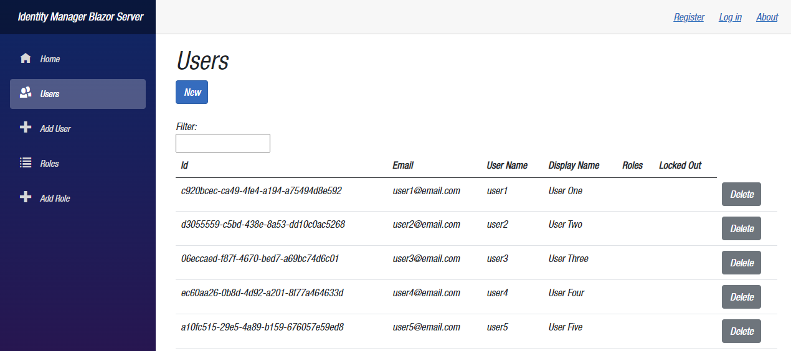

# Table of Contents

- [Table of Contents](#table-of-contents)
  - [Introduction](#introduction)
  - [Prerequisites](#prerequisites)
    - [.NET 6.0](#net-60)
    - [Visual Studio 2022](#visual-studio-2022)
    - [Mobile Development with .NET Workload](#mobile-development-with-net-workload)
  - [Demo](#demo)
    - [Create a Blazor Server Application](#create-a-blazor-server-application)
  - [Summary](#summary)
  - [Complete Code](#complete-code)
  - [Resources](#resources)

## Introduction

In this demo, we are going to build a `netstandard` class library based on the `GitHub` repo by `mguinness` that was shown in episodes [Basic Authentication and Authorization in Blazor Server: Carl Franklin's Blazor Train ep 26
](https://www.youtube.com/watch?v=mbNFscKBsy8&list=PL8h4jt35t1wjvwFnvcB2LlYL4jLRzRmoz&index=30&t=790s), and [Basic Authentication and Authorization in Blazor Web Assembly: Carl Franklin's Blazor Train ep 27](https://www.youtube.com/watch?v=I3A1R-oBK7c&list=PL8h4jt35t1wjvwFnvcB2LlYL4jLRzRmoz&index=31), and that you can find [here](https://github.com/mguinness/IdentityManagerUI).

Then, we are going to build a Blazor Server application, and make use of the `netstandard` class library.

The end results will look like this:

## Prerequisites

The following prerequisites are needed for this demo.

### .NET 6.0

Download the latest version of the .NET 6.0 SDK [here](https://dotnet.microsoft.com/en-us/download).

### Visual Studio 2022

For this demo, we are going to use the latest version of [Visual Studio 2022](https://visualstudio.microsoft.com/vs/community/).

### Mobile Development with .NET Workload

In order to build Blazor apps, the ASP.NET and web development workload needs to be installed, so if you do not have that installed let's do that now.

  

## Demo

In the following demo we will first create a `netstandard` class library, based on the `GitHub` repo [mguinness/IdentityManagerUI](https://github.com/mguinness/IdentityManagerUI), then we are going to build a Blazor Server application, to make use of the `netstandard` class library.

### Create a Blazor Server Application

## Summary

For more information about Blazor, check the links in the resources section below.

## Complete Code

The complete code for this demo can be found in the link below.

- <https://github.com/payini/REPLACE_HERE>

## Resources

| Resource Title                   | Url                                                                        |
| -------------------------------- | -------------------------------------------------------------------------- |
| The .NET Show with Carl Franklin | <https://www.youtube.com/playlist?list=PL8h4jt35t1wgW_PqzZ9USrHvvnk8JMQy_> |
| Download .NET                    | <https://dotnet.microsoft.com/en-us/download>                              |
